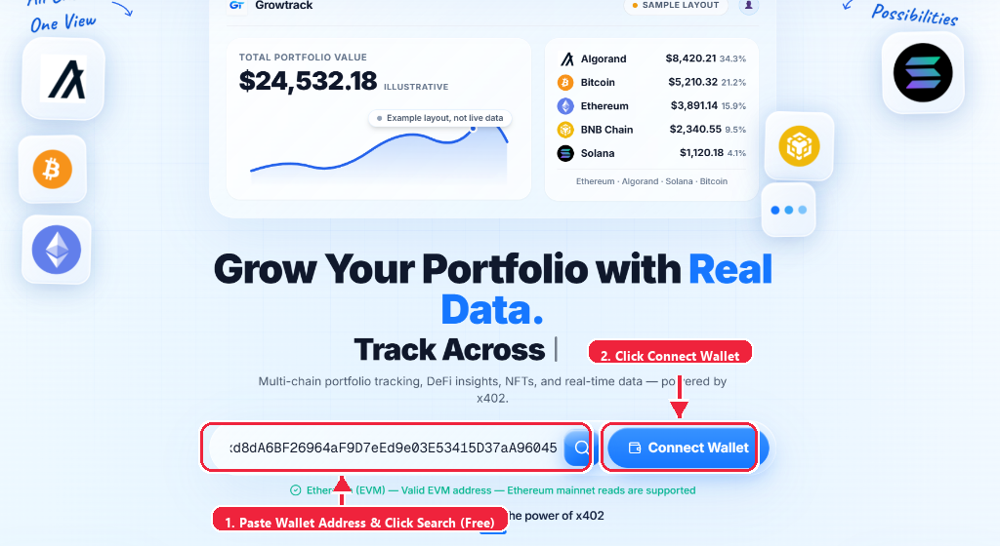
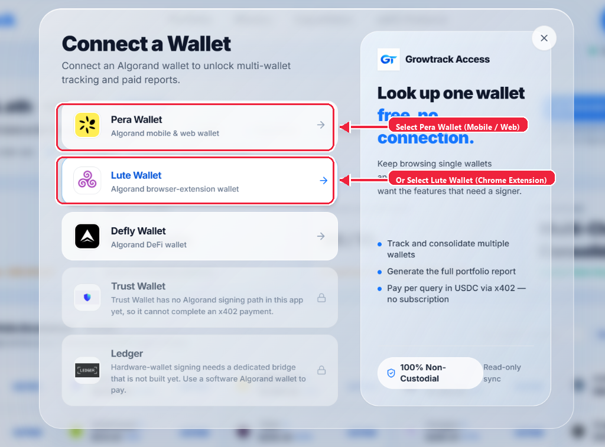
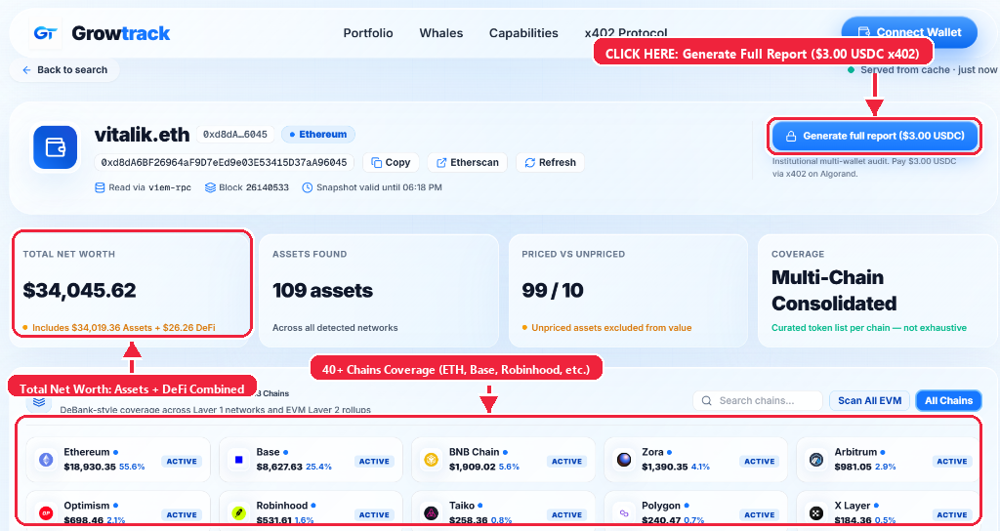
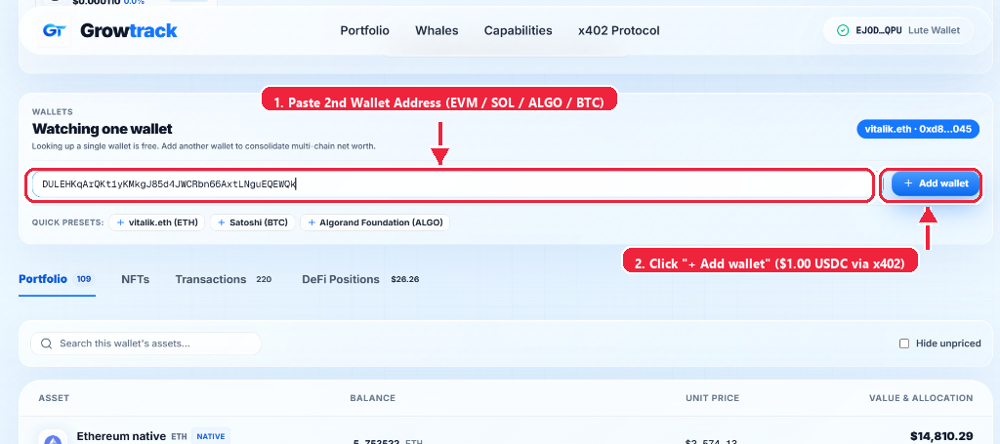
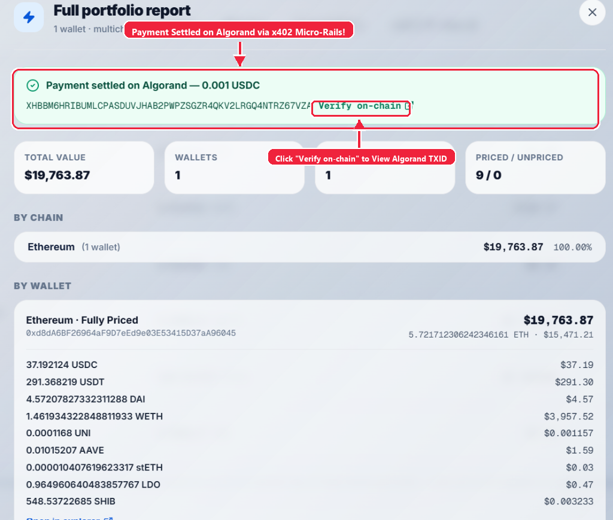

# Growtrack

> **Multichain Wallet Intelligence & x402 Micropayment Protocol**  
> _Built for the Algorand Global x402 Challenge — Powered by Algorand MainNet & GoPlausible Facilitator_

[](https://facilitator.goplausible.xyz)
[](https://lora.algokit.io/mainnet/asset/31566704)
[](https://nextjs.org)
[](https://fastify.dev)
[](https://www.typescriptlang.org)
[](https://vitest.dev)

---

## What is Growtrack?

**Growtrack** is a multichain financial intelligence platform and agentic commerce gateway. It turns raw on-chain wallet addresses across multiple blockchains (**Algorand**, **Ethereum / EVMs**, **Bitcoin**, and **Solana**) into deep financial intelligence, truthful token valuations, and live transaction ledgers.

On top of the intelligence layer, Growtrack implements the **HTTP 402 "Payment Required" (x402) standard** native to Algorand. Users and autonomous AI agents can instantly pay for live portfolio snapshots, cross-chain consolidation reports, and machine-readable data feeds using gasless **Algorand USDC micropayments** via the official **GoPlausible Facilitator**.

### Core Product Principles

1. **Absolute Truthfulness**: Never fabricate fake balances, fake PnL % changes, or mocked historical charts. If token pricing is unavailable, assets are explicitly marked as `Unpriced` rather than defaulting to $0.00.
2. **Zero Friction for Explorers**: Any user can look up and analyze their first wallet completely free and anonymously — zero wallet connection, zero account creation, zero payment.
3. **Native x402 Micropayments**: Advanced features (such as multi-wallet cross-chain consolidation statements and live synchronous agent feeds) are gated by genuine on-chain Algorand USDC micro-transactions.
4. **Agent-First Discovery**: Provides built-in discovery surfaces (`/.well-known/x402`, `/llms.txt`, `/v1/chains`, and Bazaar extensions) allowing autonomous AI agents to discover, negotiate, pay, and consume Growtrack services programmatically.

---

## User Guide: How to Use Growtrack

> 📄 **PDF Version Available**: You can also download our complete [Growtrack Beginner User Guide (PDF)](Growtrack_Beginner_User_Guide.pdf) with visual step-by-step annotations.

Whether you are a new community user, a DeFi power user, or a judge evaluating the project, follow this visual step-by-step walkthrough to get started:

### Step 1: Look Up Any Wallet for Free (Zero Setup)

1. Open the Growtrack dashboard at [growtrack.pro](https://growtrack.pro).
2. In the hero search bar, paste any public wallet address:
   - **Ethereum / EVM**: `0xd8dA6BF26964aF9D7eEd9e03E53415D37aA96045` (or any ENS name / 0x address)
   - **Algorand**: `JJNP4JGSR5ICF5NTMVC4TO7CE4KM2FDL7G4LAEEFIK2KVGL6RTPLPGMTB4`
   - **Bitcoin**: `1A1zP1eP5QGefi2DMPTfTL5SLmv7DivfNa`
   - **Solana**: `GJRs4FwHtemZ5ZE9x3FNvJ8TMwitKTh21yxdRPqn7npE`
3. Click the blue **Search** button or pick one of the quick presets (`vitalik.eth`, `Satoshi`, `Algorand Foundation`).
4. To prepare for x402 multi-wallet consolidation or report generation, click **"Connect Wallet"**.



---

### Step 2: Connect Your Algorand Wallet (Pera / Lute / Defly)

To unlock x402-powered features (such as multi-wallet consolidation and full institutional statements), connect an Algorand signer:

- **Mobile Users**: Select **Pera Wallet** or **Defly Wallet** and scan the QR code.
- **Desktop / Chrome Extension**: Select **Lute Wallet** for instant 1-click signing.



---

### Step 3: Multi-Chain Breakdown & Generate Full Report

- **Total Net Worth**: Live aggregated valuation combining direct token assets and real-time DeFi protocol positions (Hyperliquid, Polymarket, Uniswap, Pendle, Velodrome) — calculated just like DeBank.
- **50+ Chains Covered**: Click any chain pill (e.g. **Robinhood**, **Base**, **Arbitrum**, **Polygon**, **zkSync**, **Mantle**, **X Layer**, **Cronos**) to inspect holdings on that specific network.
- **Generate Full Report ($3.00 USDC via x402)**: Click the **"Generate full report ($3.00 USDC)"** button at top right to initiate an authentic Algorand MainNet micropayment.



---

### Step 4: Multi-Wallet Portfolio Consolidation ($1.00 USDC via x402)

Consolidate multiple personal wallets into a single unified net worth view:

1. Paste your second wallet address (EVM, Solana, Bitcoin, or Algorand) into the **"Watching one wallet"** input field.
2. Click **"+ Add wallet"** and approve the **$1.00 USDC** x402 micropayment on Algorand.
3. Your portfolios are now unified and can be switched or viewed together in **"All Wallets"** mode!



---

### Step 5: Full Institutional Report & On-Chain Settlement Verification

Once payment is settled:

- The full multi-wallet statement unlocks instantly.
- The green banner displays the **Algorand transaction ID** proving genuine on-chain payment.
- Click **"Verify on-chain"** to verify the settlement on the official Algorand block explorer (Lora / AlgoKit).



---

## Supported Blockchains & Read Architecture

Growtrack reads native balances, token holdings, and live DeFi positions behind a unified `ChainDataProvider` interface:

| Blockchain           | Identifier                                                                                                                                                                                                                       | Native Coin                                            | Data Source / Upstream Port                   | Features                                                                                                                                   |
| :------------------- | :------------------------------------------------------------------------------------------------------------------------------------------------------------------------------------------------------------------------------- | :----------------------------------------------------- | :-------------------------------------------- | :----------------------------------------------------------------------------------------------------------------------------------------- |
| **Ethereum (EVM)**   | `ethereum`                                                                                                                                                                                                                       | `ETH`                                                  | Multicall3 batch RPC + Blockscout REST        | Native balance, curated ERC-20s, USD pricing, tx ledger                                                                                    |
| **Algorand**         | `algorand`                                                                                                                                                                                                                       | `ALGO`                                                 | Algonode algod REST + Indexer                 | ALGO balance, curated ASAs (USDC/USDt), round times, tx index                                                                              |
| **Bitcoin**          | `bitcoin`                                                                                                                                                                                                                        | `BTC`                                                  | Esplora REST API                              | UTXO balance, real input/output ledger entries, block confirmations                                                                        |
| **Solana**           | `solana`                                                                                                                                                                                                                         | `SOL`                                                  | Keyless Solana JSON-RPC + Jupiter metadata    | SOL balance, SPL token accounts, slot confirmations                                                                                        |
| **50+ Chains & L2s** | `robinhood`, `base`, `arbitrum`, `bsc`, `polygon`, `optimism`, `avalanche`, `zksync`, `mantle`, `xlayer`, `cronos`, `linea`, `scroll`, `ink`, `mode`, `sonic`, `sei`, `celo`, `taiko`, `apechain`, `unichain`, `berachain`, etc. | `ETH`, `OKB`, `MNT`, `CRO`, `BNB`, `AVAX`, `POL`, etc. | Verified High-Speed Mainnet RPCs + Multicall3 | Native balances, token discovery, real-time DeFi positions (Hyperliquid, Uniswap, Polymarket, Pendle), DeBank-style consolidated net worth |

---

## x402 Micropayment Protocol & Bazaar Discovery

Growtrack implements the **x402 Specification (v2)** to monetize API access directly over Algorand rails:

```
[ Client / Agent ]                              [ Growtrack API ]                       [ GoPlausible Facilitator ]
        |                                               |                                           |
        |--- 1. GET /v1/portfolio/report -------------->|                                           |
        |<-- 2. HTTP 402 Payment Required --------------|                                           |
        |       (Network, USDC ASA, payTo, Amount)      |                                           |
        |                                               |                                           |
        |--- 3. Sign gasless payment via Algorand ----->|                                           |
        |--- 4. GET /report with PAYMENT-SIGNATURE ---->|                                           |
        |                                               |--- 5. POST /verify & /settle ------------>|
        |                                               |<-- 6. Settlement confirmed (txid) --------|
        |<-- 7. HTTP 200 OK with Live Data -------------|                                           |
        |       (Header: PAYMENT-RESPONSE txid)         |                                           |
```

### MainNet Configuration

- **Network**: `algorand:wGHE2Pwdvd7S12BL5FaOP20EGYesN73ktiC1qzkkit8=` (Algorand MainNet)
- **Asset ID**: `31566704` (MainNet USDC, 6 decimals)
- **Facilitator**: `https://facilitator.goplausible.xyz`
- **Competition Tag**: `x402-global-challenge`
- **Merchant `payTo`**: `BBGDH6PTIDBHDRA2VYELPMIO7D7RSJD7NB4GUTZRXXUYYUW3ZKBYWM6VPE` (Opted into USDC)

### Agent Discovery Endpoints

- `GET /.well-known/x402`: Publishes machine-readable resource descriptors and Bazaar metadata.
- `GET /llms.txt`: Structured plain-text guidance for LLMs and autonomous agents discovering Growtrack tools.
- `GET /v1/chains`: Lists all active read providers, address formats, and native assets.
- `GET /v1/chains/detect?address=...`: Automatically detects candidate chains for any bare address string.

---

## API Reference

### Free Endpoints (No Authentication / No Payment)

- `GET /v1/wallets/analyze?address=:address&chain=`: Live read with auto chain-detection and real USD pricing.
- `GET /v1/chains`: Enumerate supported blockchain networks.
- `GET /v1/chains/detect?address=:address`: Detect network format for any public address.
- `GET /v1/payments/algorand/params`: Current Algorand suggested parameters for building client payments.
- `GET /health/live` & `GET /health/ready`: System health check endpoints (Database + Redis status).
- `GET /docs`: Interactive Swagger / OpenAPI documentation UI.

### Paid Endpoints (x402 Gated)

- `GET /v1/wallets/:chain/:address/live`: Synchronous fresh snapshot.
- `GET /v1/portfolio?addresses=:addr1,:addr2`: Multi-wallet portfolio totals.
- `GET /v1/portfolio/report?addresses=:addr1,:addr2`: Complete consolidated portfolio report.

---

## Local Development & Setup

### Prerequisites

- **Node.js**: `v20.11.0` or newer
- **Docker Desktop**: For PostgreSQL and Redis containers
- **npm**: `v10` or newer

### Quickstart

1. **Clone the repository**:

   ```bash
   git clone https://github.com/GrowEdge5/growtrack.git
   cd growtrack
   ```

2. **Configure environment**:

   ```bash
   cp .env.example .env
   ```

3. **Start local database & cache**:

   ```bash
   docker compose up -d postgres redis
   ```

4. **Install dependencies & run migrations**:

   ```bash
   npm install
   npm run prisma:generate
   npm run prisma:migrate
   ```

5. **Start services**:
   - In Terminal 1 (Backend API):
     ```bash
     npm run dev
     # Listens at http://localhost:3000
     ```
   - In Terminal 2 (Web Frontend):
     ```bash
     npm run dev:web
     # Listens at http://localhost:3001
     ```
   - In Terminal 3 (Optional Queue Worker):
     ```bash
     npm run dev:worker
     ```

6. Open `http://localhost:3001` in your browser.

---

## Quality Verification & Tests

Growtrack maintains rigorous test coverage with zero mocked shortcuts on production routes:

```bash
# Run full CI pipeline
npm run ci

# Run test suite (86 unit & e2e tests)
npm test

# Run TypeScript checks across root and Next.js web application
npm run typecheck

# Run linter
npm run lint
```

---

## Algorand Global x402 Challenge Checklist

| Requirement                    | Implementation Details                                                                         | Status   |
| :----------------------------- | :--------------------------------------------------------------------------------------------- | :------- |
| **Paid x402 Endpoint**         | Implemented on `/v1/wallets/:chain/:address/live`, `/portfolio`, and `/portfolio/report`       | Verified |
| **HTTP 402 Specifications**    | Full RFC-compliant 402 responses with JSON body and base64 `PAYMENT-REQUIRED` headers          | Verified |
| **GoPlausible Facilitator**    | Verifies and settles atomic transaction groups via `https://facilitator.goplausible.xyz`       | Verified |
| **MainNet USDC Rails**         | Settles in ASA `31566704` on Algorand MainNet (`wGHE2Pwdvd7S12BL5FaOP20EGYesN73ktiC1qzkkit8=`) | Verified |
| **Challenge Tag**              | Emits `x402-global-challenge` tag in payment requirements extra payload                        | Verified |
| **Bazaar Discovery**           | Exposes full `resource` descriptor, `extensions.bazaar`, `/.well-known/x402`, and `/llms.txt`  | Verified |
| **MainNet Settlements**        | 12+ real on-chain MainNet settlements completed and permanently verifiable on Lora             | Verified |
| **Non-Custodial Architecture** | Growtrack holds zero private keys and never signs on behalf of users                           | Verified |
| **Public HTTPS Deployment**    | Configured for `https://growtrack.pro` with valid Let's Encrypt TLS certificate                | Ready    |

---

## License

This project is licensed for the Algorand Global x402 Challenge.
